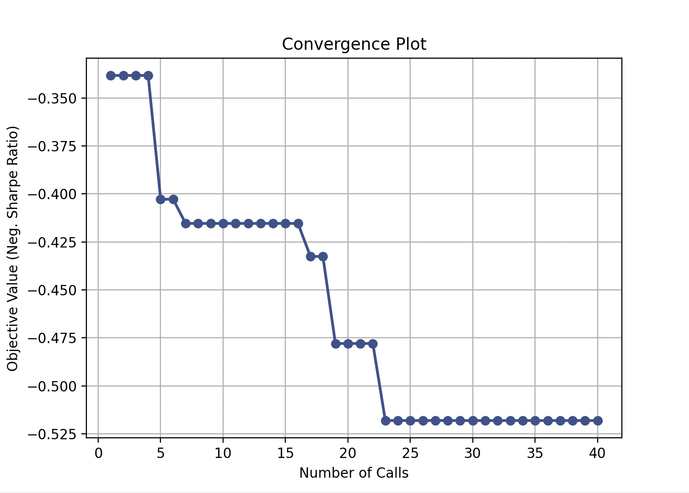
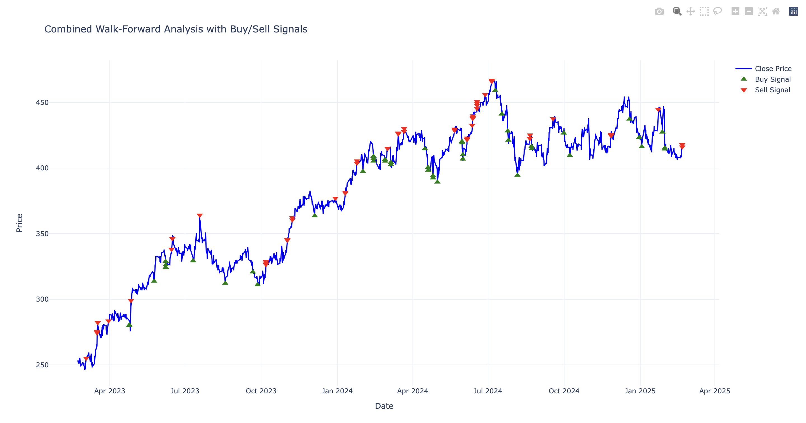

# Algorithmic Trading System using Bayesian Optimization

This project implements a high-performance framework for optimizing trading strategies. 

### Key Features:
* **Bayesian Optimization:** Uses Gaussian Processes to efficiently find optimal strategy hyperparameters.
* **Objective Function:** Maximizes risk-adjusted returns (Sharpe Ratio) while minimizing drawdown.
* **Tech Stack:** Python, Scikit-Optimize, Pandas.

### Optimization & Backtesting Results

The system utilizes Bayesian Optimization to find the most robust parameters for a trading strategy, followed by a walk-forward analysis to validate performance on out-of-sample data.

#### 1. Optimization Convergence
This plot tracks the objective function (Negative Sharpe Ratio) over 40 iterations. The algorithm efficiently navigates the parameter space, converging on a global optimum that maximizes risk-adjusted returns while minimizing computational cost.

#### 2. Walk-Forward Analysis (Buy/Sell Signals)
To prevent overfitting, the strategy is validated using a walk-forward framework. The chart below displays the execution of Buy (green) and Sell (red) signals against the underlying price action, demonstrating the model's predictive power on unseen market data.

